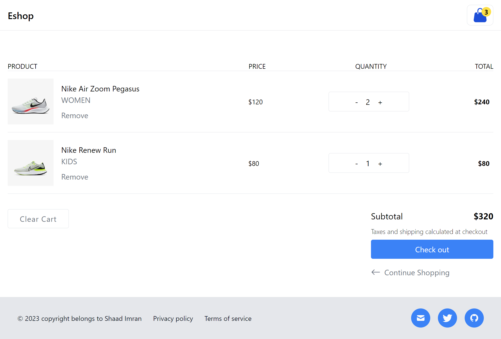

# React Redux Toolkit Shopping Cart

A simple shopping cart application built with React, Redux Toolkit, and styled with Tailwind CSS. This project allows users to browse a collection of shoes, add them to their cart, and manage their cart contents. The cart data is also stored in the local storage, ensuring a seamless shopping experience even after refreshing the page.

## Features

- **Product Catalog:** Display a list of shoes with details like name, price, and an "Add to Cart" button.
- **Shopping Cart:** Maintain a shopping cart to add and remove items.
- **Total Calculation:** Dynamically calculate the total price of items in the cart.
- **Local Storage:** Cart data is stored in the local storage, ensuring data persistence between sessions.
- **Responsive Design:** Designed to work seamlessly on different screen sizes.

## Usage

To use this shopping cart application, follow these simple steps:

1. **Browse the Catalog:** Browse the list of available shoes in the product catalog.

2. **Add to Cart:** Click the "Add to Cart" button for the shoes you want to purchase. These items will be added to your cart.

3. **View and Manage Cart:** Open the cart to view and manage the items you've selected. You can review your choices, adjust quantities, and remove items if needed.

4. **Total Calculation:** The total price of your cart will be automatically calculated based on the items and quantities you've selected.

5. **Data Persistence:** Your cart data is automatically saved to local storage. This means you won't lose your items even if you refresh the page or close your browser. Your selections are safe and sound for your next shopping session.
